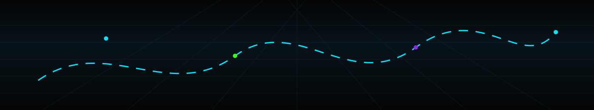

<div align="center">



[](https://git.io/typing-svg)


</div>


## `MISSION CONTROL`

<div align="center">

| Signal | Status |
|---|---|
| `SYSTEM STATUS` | `ONLINE` |
| `ROLE` | `Cybersecurity Student` |
| `TRACK` | `Offensive Security & Honeypot Builder` |
| `ACTIVE PROJECTS` | `Honeypots / Automation / Malware Lab / GitHub Profile` |
| `MAIN STACK` | `Go / Rust / Python / TypeScript` |
| `OPERATING MODE` | `Observe. Detect. Automate. Exploit. Harden.` |

</div>

```console
[dylan@mission-control ~/lab]$ ./status --profile DylanK77

[+] identity loaded: Dylan Klein
[+] cybersecurity alternance: active
[+] offensive lab: online
[+] honeypot research: running
[+] automation scripts: shipping
[+] signal quality: clean
```

<div align="center">
  
</div>


## `CYBER LAB`

<div align="center">

| Lab Area | What I Build |
|---|---|
| `Honeypots` | Deception services, trap logic, telemetry collection |
| `Malware Analysis` | Isolated analysis workflows, static and behavioral research |
| `Packet Inspection` | Network visibility, protocol observation, capture analysis |
| `Offensive Tooling` | Practical scripts, recon helpers, security automation |
| `SaaS Security` | Secure dashboards, automation panels, operational tooling |

</div>

<div align="center">
  
</div>

## `TECH STACK`

<div align="center">


<br/><br/>


</div>


## `PUBLIC REPOSITORIES`

<div align="center">

<table>
  <tr>
    <td width="50%">
      <h3><code>globalexam-bot</code></h3>
      <p>Automation project focused on repeatable workflows and practical scripting.</p>
      <p><b>Stack:</b> Automation / Scripts</p>
      <p><b>Status:</b> Public Repository</p>
      <p><b>Objective:</b> Build useful automation with clean execution logic.</p>
      <a href="https://github.com/DylanK77/globalexam-bot">
        
      </a>
    </td>
    <td width="50%">
      <h3><code>template-securite-python</code></h3>
      <p>Python security template for cleaner project starts and safer structure.</p>
      <p><b>Stack:</b> Python / Security</p>
      <p><b>Status:</b> Public Repository</p>
      <p><b>Objective:</b> Standardize secure Python project foundations.</p>
      <a href="https://github.com/DylanK77/template-securite-python">
        
      </a>
    </td>
  </tr>
  <tr>
    <td width="50%">
      <h3><code>asm_tp</code></h3>
      <p>Assembly coursework and low-level programming practice.</p>
      <p><b>Stack:</b> Assembly / Low-Level</p>
      <p><b>Status:</b> Public Repository</p>
      <p><b>Objective:</b> Strengthen fundamentals close to the machine.</p>
      <a href="https://github.com/DylanK77/asm_tp">
        
      </a>
    </td>
    <td width="50%">
      <h3><code>3SI3</code></h3>
      <p>Academic and technical repository connected to cybersecurity learning.</p>
      <p><b>Stack:</b> Coursework / Engineering</p>
      <p><b>Status:</b> Public Repository</p>
      <p><b>Objective:</b> Document progression through technical practice.</p>
      <a href="https://github.com/DylanK77/3SI3">
        
      </a>
    </td>
  </tr>
  <tr>
    <td width="50%">
      <h3><code>DylanK77</code></h3>
      <p>Profile repository powering this GitHub homepage and visual identity.</p>
      <p><b>Stack:</b> Markdown / SVG / GitHub Actions</p>
      <p><b>Status:</b> Active</p>
      <p><b>Objective:</b> Maintain a premium technical profile for recruiters and cyber peers.</p>
      <a href="https://github.com/DylanK77/DylanK77">
        
      </a>
    </td>
    <td width="50%">
      <h3><code>writeups</code></h3>
      <p>Recommended next public repo for security notes, lab reports and analysis logs.</p>
      <p><b>Stack:</b> Markdown / Security Research</p>
      <p><b>Status:</b> Recommended</p>
      <p><b>Objective:</b> Show methodology, clarity and technical maturity.</p>
      <a href="https://github.com/DylanK77?tab=repositories">
        
      </a>
    </td>
  </tr>
</table>

</div>


## `CURRENTLY BUILDING`

```txt
> GitHub profile system with custom SVG assets and automated visuals
> Cyber tools for offensive security learning and lab operations
> Automation scripts for repeatable technical workflows
> SaaS security dashboards and clean operational interfaces
> Writeups for honeypots, malware analysis and packet inspection
```

## `WRITEUPS ROADMAP`

<details>
<summary><b>Planned security notes</b></summary>

```txt
01. Building a simple honeypot and collecting useful telemetry
02. Malware analysis lab setup: isolation, snapshots and workflow
03. Packet inspection notes: from capture to hypothesis
04. Python security project template: structure, hygiene and automation
05. Offensive automation: small scripts that save serious time
```

</details>


## `GITHUB TELEMETRY`

<div align="center">


<br/>


</div>

## `CONTRIBUTION SYSTEMS`

<div align="center">


<br/><br/>


</div>


## `CONTACT`

<div align="center">

<a href="https://github.com/DylanK77">
  
</a>

<!-- Add this only when your LinkedIn is clean and ready:
<a href="https://www.linkedin.com/in/YOUR-LINKEDIN-HERE">
  
</a>
-->

```console
[recruiter@internet ~/contact]$ ./connect --target DylanK77 --signal professional
```

</div>

<div align="center">


</div>
